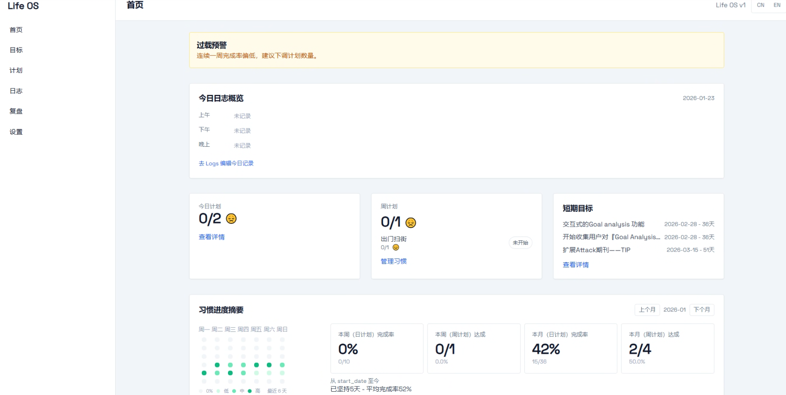
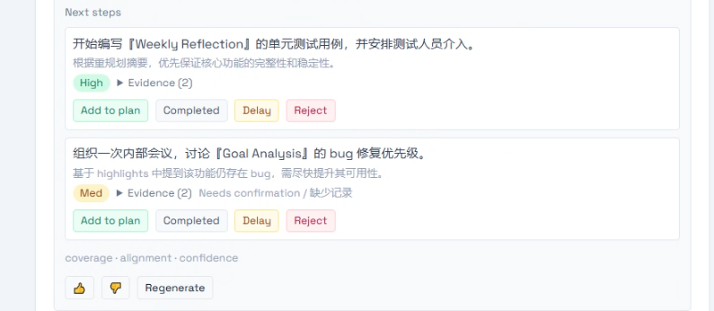
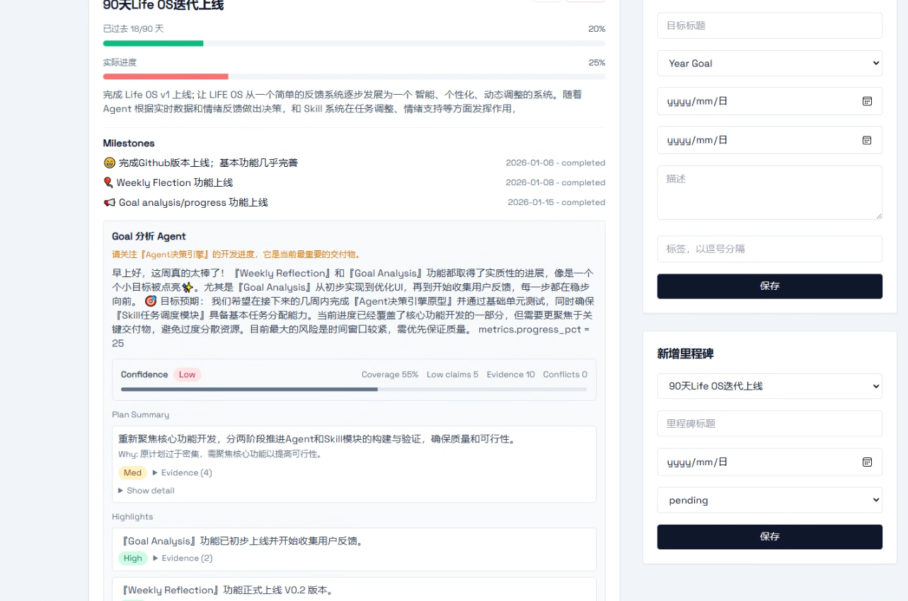
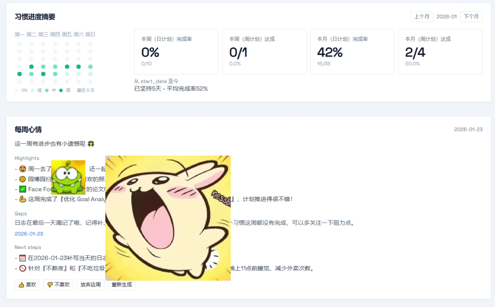

# Life OS v1 🌱

Life OS 是个人开发的一个 『习惯/日记/计划』 管理的Agent分析系统。为了方便你快速了解项目，你可以在『项目快速预览』介绍中了解项目功能，如果你已经对这个项目有了一定的兴趣，可以跳转 ☞『快速开始』进行部署。



## 项目快速预览

### 『User interaction』→ 👶 v0.4

* NEW❗❗❗ 新增——对『Goal Analysis』中的Next steps进行选择：加入短期计划、已完成（因为可能有些任务已经完成但是日志没有记录）、推迟、拒绝



### 『Goal Analysis』→ 🖥 v0.3

* 新增——对用户的『习惯/日记/计划』进行分析，通过 Agent 进行规划，提供`Summary`, `实时进度条`, `NEXT STEPS`等更加智能的分析



### 『weekly reflection』📅 → v0.2

* 新增——通过 Agent 对用户『习惯/日记/计划』进行每周回顾与分析，如图所示：



### 『Basis function』🌱→ v0.1

* 每日日志——记录一天的行动
* 习惯管理——每日、每周习惯进行打卡
* 目标管理——长期目标、短期计划管理

## 快速开始

### 1. 创建环境 🌱

```
python -m venv .venv
```

- **Windows**:

  ```
  .\.venv\Scripts\activate
  ```

- **macOS/Linux**:

  ```
  source .venv/bin/activate
  ```

### 2. 安装依赖 🔧

```
pip install -r requirements.txt
```

### 3. 初始化数据库

```
python manage.py migrate
```

即使不运行改代码也没关系，可以直接跳到下一步，会自动创建数据库: lifeos.db

### 4. 运行LIFE OS🚀

```
uvicorn app.main:app --reload
```

本地地址：

```
http://127.0.0.1:8000
```

### 5. AI 配置

除了基本功能，v0.2的功能都需要进行ai配置，本项目选择了免费的魔塔社区key进行配置，每日有2000配额，完全够用

🔑 你可以到 https://modelscope.cn/获取属于你的**LLM_API_KEY**

🔧在Llfe OS中，跳转至**Settings-LLM settings**, 配置 **LLM_API_KEY** 以及 **Model Name** 

🎉  配置完成后，你就可以使用全部功能啦！

