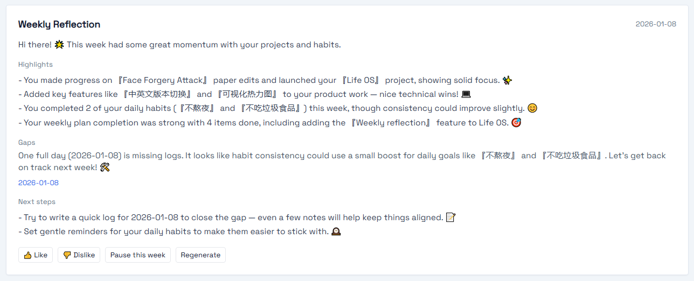

# Life OS v1 🌱

Life OS v1 is a productivity system built using **FastAPI**, **SQLModel**, **Jinja2**, and **HTMX**. It helps users manage daily, weekly, and short-term goals, track habits, and organize their life efficiently.

## Project Overview 🧑‍💻

Life OS is a simple yet powerful system designed to help individuals organize their daily tasks, track their habits, and achieve their goals. Built using modern web technologies, it provides:

- **Dynamic Daily and Weekly Plans** 📅 to manage tasks
- **Real-time Habit Tracking** 💪 and progress monitoring
- **Heatmap Visualization** 🔥 for habit progress
- **Smart Weekly Reflection** 🧠 powered by AI to optimize your schedule 

## Installation 💻

### 1. **Set up a Virtual Environment** 🌱

To begin, create and activate a virtual environment for the project:

```
python -m venv .venv
```

- **Windows**:

  ```
  .\.venv\Scripts\activate
  ```

- **macOS/Linux**:

  ```
  source .venv/bin/activate
  ```

### 2. **Install Dependencies** 🔧

Next, install the required dependencies using `pip`:

```
pip install -r requirements.txt
```

This will install **FastAPI**, **SQLModel**, **Jinja2**, **HTMX**, and other necessary libraries.

### 3. Init Database 🔄

The app **auto-initializes the SQLite database** on startup. If you want to manually manage migrations or customize the database location

To apply database migrations or initialize the database:

```
python manage.py migrate
```

------

## Running the App 🚀

Once dependencies are installed, you can start the application:

```
uvicorn app.main:app --reload
```

This will start the app on the default port `8000`. Open your browser and navigate to:

```
http://127.0.0.1:8000
```

---

### Weekly Reflection 🔍

Life OS includes a **Weekly Reflection** card to help you review the past 7 days with a gentle, encouraging tone.

#### Modes

- **Rules mode (default)**
   Works out of the box — no settings required. Reflections are generated locally based on your **Logs / Habits / Plans**.
- **AI mode (optional)**
   If you want richer and more personalized reflections, you can enable AI generation via ModelScope.

#### **Set your AI mode **

* Get your **LLM_API_KEY** from https://modelscope.cn/
* In Llfe OS, go to  **Settings-LLM settings**, set your **LLM_API_KEY** and the **Model Name** ;
* Then you can enjoy your own Weely Reflection like this 🎉 


